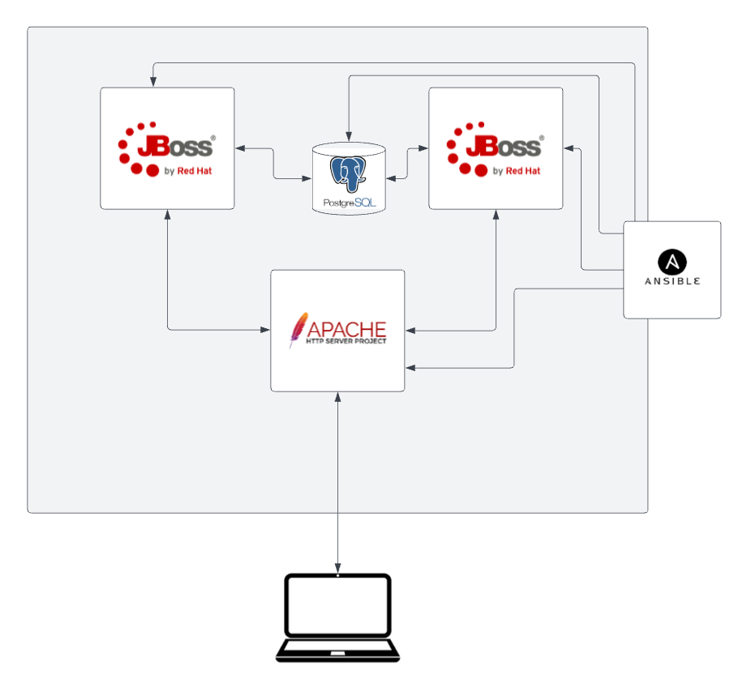

<h1 align="center"><a href="https://github.com/ansible-middleware/ansible-middleware-workshop/blob/main/instructions/1-environment-setup.md">Start here!</a></h1>

# Ansible-middleware workshop

Learn how to deploy JBoss EAP, a PostgreSQL database and a load balancer using Ansible and the ansible-middleware library (maintained at https://ansible-middleware.github.io/).  This workshop will deploy the following components:

* 2 x JBoss EAP instances running a simple addressbook application
* 1 x Postgres database, shared by the JBoss EAP instances for persistence
* 1 x Load balancer, to share traffic across the JBoss EAP instances

The architecture is depicted below.

## Get Started

### Prerequisites

You will need an Red Hat network account to be able to download the JBoss EAP installation zip files.  The account you use must not be managed by SSO in order for the Ansible scripts to be able to authenticate.  You can create a new account by following the instructions in the [Red Hat Customer Portal](https://sso.redhat.com/auth/realms/redhat-external/login-actions/registration?client_id=customer-portal&tab_id=RiPOv96eZ74).  You will need to use these credentials when you run the ansible playbooks later in the workshop.

### Instructions

1. [Set up your environment](instructions/1-environment-setup.md)
2. [Learn about adding collections](instructions/2-adding-collections.md)
3. [Configure postgresql](instructions/3-configuring-postgresql.md)
4. [Deploying JBoss EAP](instructions/4-deploying-jboss-eap.md)
5. [Configuring JBoss EAP](instructions/5-configuring-jboss-eap.md)
6. [Deploying applications](instructions/6-deploying-applications.md)
7. [Deploying JBoss Core Services](instructions/7-deploying-jbcs.md)
8. [Testing](instructions/8-testing.md)
9. [Combining the playbooks](instructions/9-combining.md)
10. [Day 2 operations](instructions/10-day-two.md)

