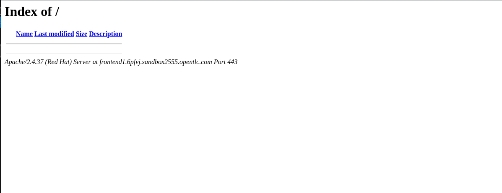

# 7 - Deploying JBoss Core Services

Now that the application is deployed, we can access the application by connecting to each individual JBoss EAP instance.  But what we really is need is a load balancer to sit in front of these two nodes, providing a single IP address to access all instance of the application.  JBoss Core Services will provide this funationality for use using mod_cluster.

create a file pre-reqs.yml

```
---
- name: Playbook for installing prerequisites
  hosts: all
  tasks:
    - name: "Install packages"
      ansible.builtin.include_role:
        name: fastpackages
      vars:
        packages_list:
          - procps-ng
          - mailcap
          - unzip
          - firewalld
          - ca-certificates
          - python3-lxml
          - net-tools
          - python3-policycoreutils
          - policycoreutils-python-utils

```

`ansible-playbook -i ./inventory/hosts pre-reqs.yml `

# Install valid ssl cert

Before we run our JBCS installation we need to install a valid SSL certificate.  To do this we'll use Let's Encrypt via certbot.

Create a file called ssl.yml and past the following

```
---
- name: Request Let's Encrypt Static Certificates
  hosts: jbcs
  become: true
  gather_facts: False
  tasks:

  - name: Install on node RHEL 8
    block:
      - name: Stop jbcs
        service:
          name: jbcs.service
          state: stopped
      - name: Enable EPEL
        dnf:
          name: "https://dl.fedoraproject.org/pub/epel/epel-release-latest-8.noarch.rpm"
          state: present
          disable_gpg_check: true

      - name: install nginx/certbot
        yum:
          name:
            - certbot
            - python3-certbot-apache
          state: present


  - name: Generate certbot
    command: >-
      certbot certonly --standalone
      -m dummy@redhat.com
      --agree-tos
      -d {{ frontend_hostname }} -n


  - name: Remove the Apache package
    ansible.builtin.yum:
      name: httpd
      state: absent

  - name: Copy letsecrypt key
    copy:
      src: "/etc/letsencrypt/live/{{ frontend_hostname }}/cert.pem"
      dest: /etc/pki/tls/certs/{{ frontend_hostname }}.crt
      remote_src: yes
      mode: 0644

  - name: Copy letsecrypt certificate
    copy:
      src: "/etc/letsencrypt/live/{{ frontend_hostname }}/privkey.pem"
      dest: /etc/pki/tls/private/{{ frontend_hostname }}.key
      remote_src: yes

      mode: 0644

  - name: Start jbcs
    service:
      name: jbcs.service
      state: started


```

Run this playbook with the following command e.g. ansible-playbook -i ./inventory/hosts ssl.yml  --extra-vars "frontend_hostname=frontend-url"

The hostname of the frontend server can be found in the email received from the RHPDS provisioning.  NOTE: Do not add the "https://" part, just the hostname

`ansible-playbook -i ./inventory/hosts ssl.yml  --extra-vars "frontend_hostname=<your frontend hostname>"`

We'll create a playbook to use this role.  Create a file called jbcs.yml in the top level folder.  Copy the following snippet to the top of the file:

```
---
- name: Playbook for loadbalancer Hosts
  hosts: jbcs
  become: true
  vars:
    jbcs_ssl_enable: true
    jbcs_zip_path: /home/devops/ansible-middleware-workshop
    jbcs_bind_address: 0.0.0.0
    jbcs_offline_install: false
    jbcs_mod_cluster_enable: true
  collections:
    - redhat.jbcs
  roles:
    - jbcs
  pre_tasks:
    - name: Set httpd_can_network_connect flag on and keep it persistent across reboots
      ansible.posix.seboolean:
        name: httpd_can_network_connect
        state: yes
        persistent: yes
    - name: Set nid_enabled flag on and keep it persistent across reboots
      ansible.posix.seboolean:
        name: nis_enabled
        state: yes
        persistent: yes
    - name: Add reverse proxied port to selinux
      ansible.builtin.command: semanage port -m -t http_port_t -p tcp 8080
      changed_when: False
    - name: Add reverse proxied port to selinux
      ansible.builtin.command: semanage port -m -t http_port_t -p tcp 8009
      changed_when: False
  tasks:
    - name: install firewalld
      become: true
      action: yum name=firewalld state=installed
    - name: Start firewalld
      become: true
      service: name=firewalld state=started enabled=yes

    - name: configure firewall for JBCS ports
      become: yes
      firewalld:
        port: "{{ port }}"
        permanent: true
        state: enabled
        immediate: yes
      loop:
        - "80/tcp"
        - "6666/tcp"
        - "443/tcp"  
      loop_control:
        loop_var: port
```

Save this file, and test the playbook by running the following command:

`ansible-playbook -i ./inventory/hosts jbcs.yml  --extra-vars "rhn_username=<your rhn login> rhn_password=<your rhn password>"` -e jbcs_external_domain_name=frontend-url


# Testing the JBCS installation

To test the JBoss Core Services are installed correctly, use your browser and navigate to the external hostname of your JBoss Core Server.

e.g. `https://frontend1.xxxxx.domainname.com`


You should see the default apache landing page.



# Using mod_cluster to configure JBCS

Now that JBoss Core Services is installed, we can configure it to use mod_cluster to provide load balancing.  To do this, we'll use the Jcliff ansible module again.  

1. In jboss.yml, add the following to tasks list before the "Fine tuning configuration" task

```
    - name: Modify sockets rule
      become: false
      local_action: template src=remote_sockets.j2 dest=./jcliff/rules/remote_sockets.jcliff.yml
```

This will confure the remote_sockets rule to point to the ip address of the JBoss Core Server.  We use an ansible template to do this, to allow us to configure dynamically based on the ip address of the JBoss Core Server.

This task will write to a file in the folder jcliff/rules, so lets create that folder with the command:

`mkdir -p jcliff/rules`

We also need to create a templates folder, and create a file called remote_sockets.j2 in that folder.  

`mkdir templates`

`touch templates/remote_sockets.j2`


Copy the following snippet to the top of the file:

```
{ "standard-sockets" => {
  "remote-destination-outbound-socket-binding" => {
    "proxy1" => {
      "host" => "{{groups['jbcs'][0]}}", "port" =>  6666,
      }
    }
  }
}
```


Next, in the existing "fine tuning configuration" task, add the following in the components section after the datasources block:
```
        - modcluster:
            proxy:
              - name: default
                proxies:
                  - proxy1
```

This configuration will use [JCliff](https://ansible-middleware.github.io/ansible_collections_jcliff/latest/README.html#about) to configure the JBoss instances with mod_cluster using the proxy1 rule that we configured in the previous step.

The last step is to configure the rules file location for modcluster, we do this by adding the following to the "fine tuning configuration" task under the JCliff section at the same level as the wfly_home variable:

`rule_file: jcliff/rules`

Save changes to jboss.yml and re-run the jboss playbook.

`ansible-playbook -i ./inventory/hosts jboss.yml --extra-vars "rhn_username=<your rhn login> rhn_password=<your rhn password>"`

# Testing the JBCS installation

Once the playbook has completed, you should be able to access the application by connecting to the load balancer with:

 `https://<load balancer ip address>/addressbook`

 

 Next [Step 8](./8-testing.md)