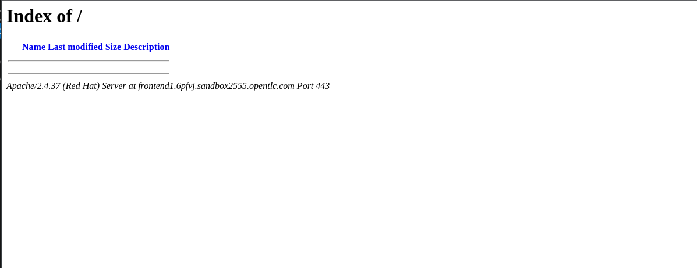

# 7 - Deploying Jboss Core Services

Now that the application is deployed, we can access the application by connecting to each individual JBoss EAP instance.  But what we really is need is a load balancer to sit in front of these two nodes, providing a single IP address to access all instance of the application.  JBoss Core Services will provide this funationality for use using mod_cluster.

To deploy JBoss Core Services, we've provided a zip file containing the role required to deploy jbcs.  To deploy this role, run the following command:

`unzip workshop/jbcs.zip -d roles`

We'll create a playbook to use this role.  Create a file called jbcs.yml in the top level folder.  Copy the following snippet to the top of the file:

```
---
- name: Playbook for JBCS Hosts
  hosts: jbcs
  become: true
  collections:
    - middleware_automation.redhat_csp_download
  roles:
    - redhat_csp_download
  tasks:
    - name: "JBoss Core Services"
      include_role:
        name: jbcs
```

Save this file, and test the playbook by running the following command:

`ansible-playbook -i ./inventory/hosts jbcs.yml  --extra-vars "rhn_username=<your rhn login> rhn_password=<your rhn password>"`

# Testing the JBCS installation

To test the JBoss Core Services are installed correctly, use your browser and navigate to the ip address of your JBoss Core Server.

e.g. `https://<ip address>`

You should see the default apache landing page.



# Using mod_cluster to configure JBCS

Now that JBoss Core Services is installed, we can configure it to use mod_cluster to provide load balancing.  To do this, we'll use the Jcliff ansible module again.  

1. In jboss.yml, add the following to tasks list before the "Fine tuning configuration" task

```
    - name: Modify sockets rule
      become: false
      local_action: template src=remote_sockets.j2 dest=./jcliff/rules/remote_sockets.jcliff.yml
```

This task will write to a file in the folder jcliff/rules, so lets create that folder with the command:

`mkdir -p jcliff/rules`

We also need to create a temlates folder, and create a file called remote_sockets.j2 in that folder.  Copy the following snippet to the top of the file:

```
{ "standard-sockets" => {
  "remote-destination-outbound-socket-binding" => {
    "proxy1" => {
      "host" => "{{groups['jbcs'][0]}}", "port" =>  6666,
      }
    }
  }
}
```


Next, in the existing "fine tuning configuration" task, add the following in the components section after the datasources block:
```
        - modcluster:
            proxy:
              - name: default
                proxies:
                  - proxy1
```

The last step is to configure the rules file location for modcluster, we do this by adding the following to the "fine tuning configuration" task under the jcliff section at the same level as the wfly_home variable:

`rule_file: jcliff/rules`

Save changes to jboss.yml and re-run the jboss playbook.

`ansible-playbook -i ./inventory/hosts jboss.yml --extra-vars "rhn_username=<your rhn login> rhn_password=<your rhn password>"`

# Testing the JBCS installation

Once the playbook has completed, you should be able to access the application by connecting to the load balancer with:

 `https://<load balancer ip address>/addressbook`

 